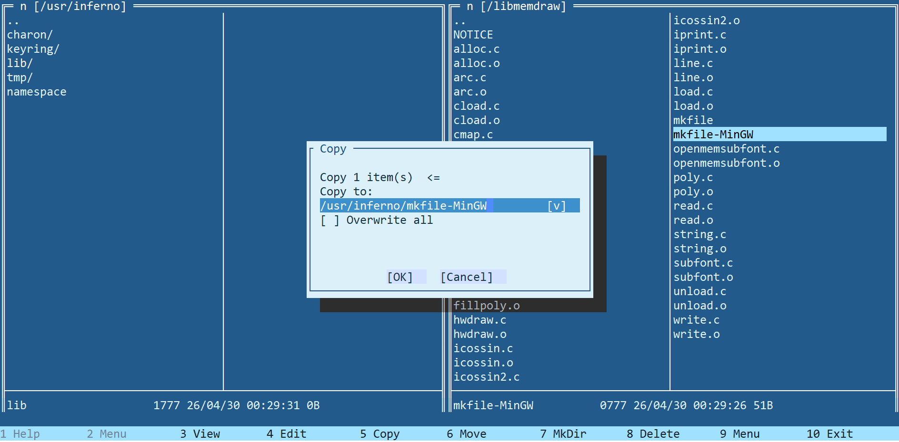

Inferno Commander is file manager for Inferno OS, inspired by Midnight Commander. The `ic` is written on Limbo, based on [icurses](https://github.com/sphynkx/icurses) framework and special version of Inferno OS - [Inferno64NG](https://github.com/sphynkx/inferno64ng). By UI organization and hotkeys `ic` is mostly compatible with MC. Project is on WIP status.

## Features
* Base file operations - copy, move, mkdir, delete, view, edit.
* Personalization for UI configuration and panels status.
* Themes support for UI appearance. Fully configurable colors schema.
* Screensavers support.
* Internal viewer and editor, also available as separate commands `icview` and `icedit`.
* Edit text buffers - in-memory and constant.
* Select, copy, paste for common and block selections.
* Codepages support for viewer.
* Text search in editor and viewer.
* VFS with support for zip, tar, tar.gz, tar.bz2 archives.

## Install
No install needed. It is a part of Inferno64NG distribution and will not work on any other forks and original version of OS.
